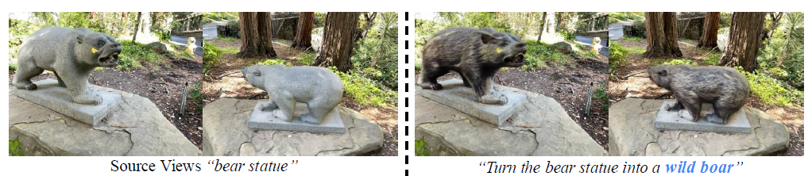
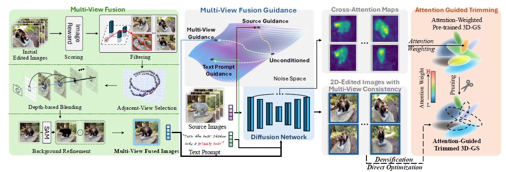
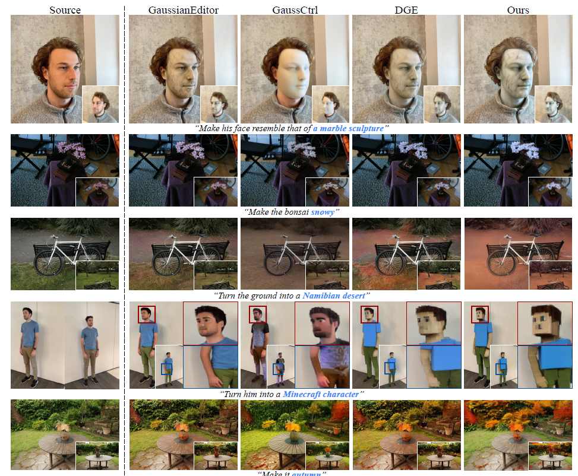
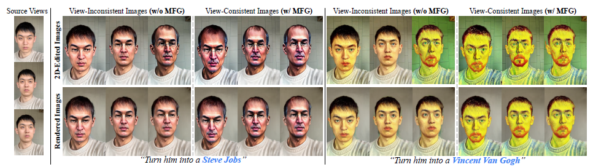
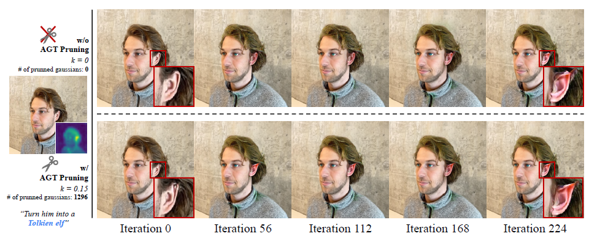
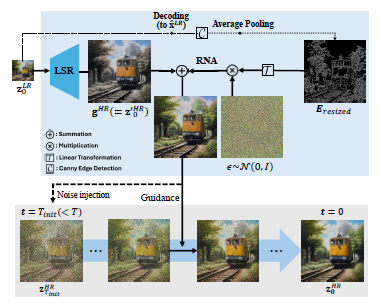
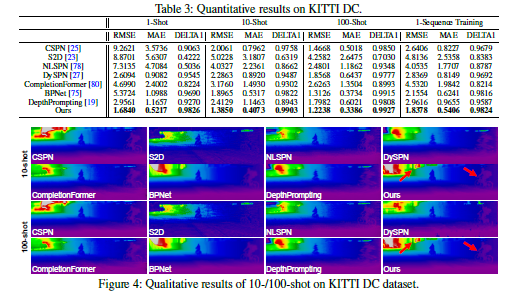
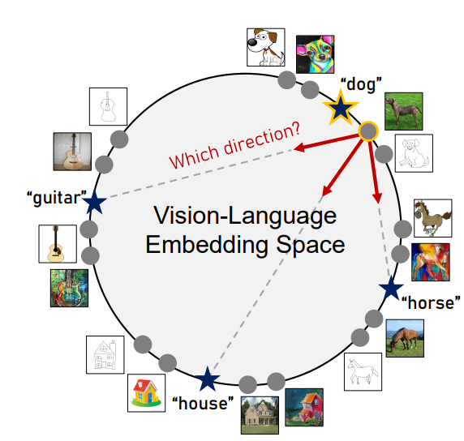
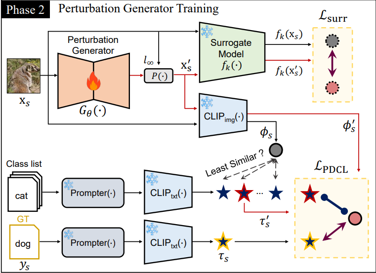
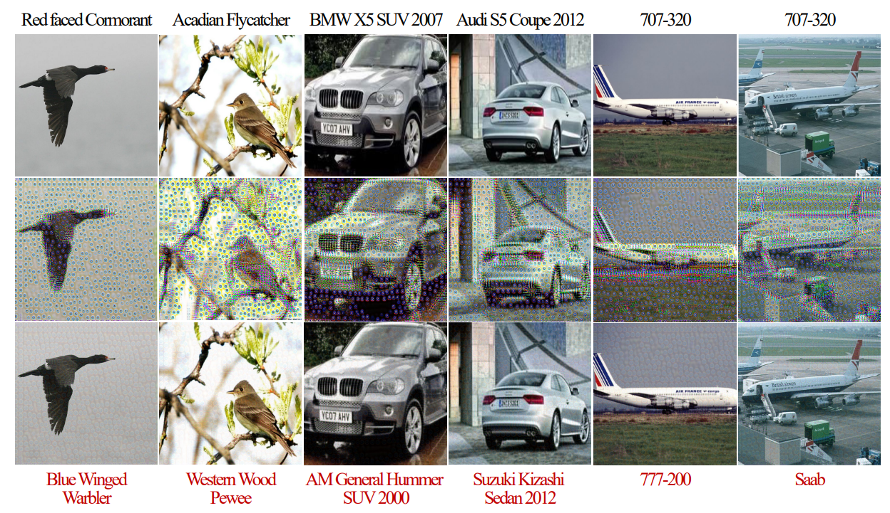

# **2025/8/4**

## EditSplat: Multi-View Fusion and Attention-Guided Optimization for View-Consistent 3D Scene Editing with 3D Gaussian Splatting
- 고려대 김상필 교수님
- 텍스트를 이용해서 3D를 수정하는 것이 목표
- ex)곰을 맷돼지로 바꿔줘
 

### Motivation
- 3D 학습데이터 부족으로 인해, 현재 대부분 2D diffusion기반 편집 사용하여 3D 편집

- 2D를 3D로 전환하면 시점 간 불일치, 비효율적인 문제 등으로 인해 선호되지 않음

### Problem
1. 기존 방법들은 **2D diffusion**에 기반하는 한계 -> 시점 간 불일치로 편집이 거의 반영되지 않거나 블러 및 아티팩트 발생시킴

2. 비효율적인 최적화로 수렴속도 저하와 낮은 편집 품질이 존재

3. 기존 방법들은 ROI(관심영역)을 정확히 추적하지 못하거나,의도치 않은 부분까지 변경하는 오류가 자주 발생 

### EditSplat Overview

- **Multi-view Fusion Guidance**: 멀티뷰 정보를 텍스트 프롬프트 및 입력 이미지와 정렬
- St,Sm,Ss라는 3가지 term을 추가해 3항의 스케일 계수를 통해 기존 문제점을 보완

- **Attention-Guided Trimming**: 최적화 효율 및 로컬 편집 성능 향상을 위한 사전학습된 가우시안 프루닝 및 선택적 최적화

### Experiment   

-다른 방법에 비해 더 일관성 있고 고품질의 정량적 결과를 확인가능

### Ablation Study
- MFG를 적용했더니 더 자연스러운 결과

- AGT로 더 효율적인 결과

## Latent Space Super-Resolution for Higher-Resolution Image Generation with Diffusion Models
- 연세대 김선주 교수님
- 고해상도 이미지를 만들어내는 연구
- generative AI시대에 어떻게 더 super resolution을 연구를 할 수 있을까
- ChatGPT,Gemini 등과 같은 생성형 AI가 output resolution은 1k정도로 고정되어있고 이 한계점에 대해 극복하고자 연구를 하게 됨

### Potential Methods
- 근본적으로 많은 데이터셋이 있으면 가능한가? -> 학습 비용이 비싸고 비효율
- 생성형 AI가 만들어주면 그 결과를 super resolution모델로 후처리를 하면 디테일이 좀 아쉬움

### Preliminary
- 기존 연구들은upsampling 후 guidance를 어떻게 붙일건가, process를 어떻게 할건가에 대해 연구함
- 본 연구는 upsampling을 어떻게 할건가에 대한 연구임

### Observation
- Latent-space upsampling : diffusion연산 한번도 버거운데 여러번 하니까 추론 속도가 너무 느림
- RGB-space: 뿌옇고 디테일이 아주 안좋음

### Method

- LR latent와 HR latent를 각각인코딩해서 training하면 아주 싸고 좋다
- High Resolution으로 바꾼 이미지와 noise를 더하는 방식
- 나머지는 기존 방식으로 적용가능 -> 어떤 모듈에도 적용 가능

### Result
- SOTA보다 좋고 최대16배만큼 가능함
- fine-tuning이 필요한 방법보다는 안좋지만 해상도가 올라갈수록 장점이 있다

### Limitation
- 모듈이기 때문에 어디에 넣냐에 따라 변화가 있을 수 있음
- 여전히 추론 속도는 느리다

### Future Work
- FID로 측정하는 건 말이 안됨, 이미지를 기껏 키워놨더니 줄여서 측정함 

## A Simple yet Universal Framework for Depth Completion
- 중앙대 
- 실생활에 3D depth completion을 정말 많이 하는 데 한계점이 많음
- 최근 연구는 **affinity map**을 통해 픽셀과 픽셀의 관계를 모델링함-> 저거를 어떻게 모델링하냐가 매우 중요했음
- 우리 눈에는 직관적인 배경이지만, 픽셀변화로 보면 스무스하게 변할 수 있기 때문에 에러가 발생하기 매우 쉬움

### Limitation
- NYU,KITTI벤치마크로 돌리면 별로 좋지 않은 성능을 보임

### IDEA
1. chat gpt와 같은 foundation모델을 이용하면 괜찮지 안을까
2. prompt engineering을 하면 괜찮지 않을까

### Methodology
- 어떤 데이터에서 학습된 모델을 다른 데이터로도 적용 가능하게 하자
- Foundation모델을 적극 이용하자
1. 이미지를 foundation모델에 넣어서 feature를 추출한다
2. initial depth를 만들자 

### Result

- KITTI로 10,100shot 성능을 확인할 수 있는데 아주 좋음
- 실제 산업에서 쓰이고 있음
 
## KeyNote
- 아키텍쳐,레시피 등 최근 CV에 대한 게 아니라 카메라,픽셀 등에 대해 구체적인 설명을 하심
- Cricket은 배터리,케이블 필요없이 빛에 따라 작동하는 데 이걸로 픽셀을 대신하는듯
- 이게 자동센서로 쓰이는듯하다. ex)현관불

## Prompt-Driven Contrastive Learning for TransferableAdversarial Attacks
- KAIST 

### Introduction
- adversarial attack이란 인위적으로 모델을 방해하는 것
- data에다가 poison을 섞는건 공격자, 그걸 찾는건 수비자
- evasion attack이란 입력에다가 공격하는 것
- **정리하자면 만들어진 모델을 속게끔 공격하는 것이다**
- transferable이라는 단어가 붙은건 여러 모델에도 두루두루 쓰일 수 있는 adversarial attack이기 때문이다
- 이게 중요한 이윤ㄴ 모델의 취약점을 식별,벤치마크로 사용 등 다양한 분야에서 쓰일 수 있음

### Related work
- **GAP, CDA, LTP, BIA, GAMMA, FACL-attack** 등 선행연구가 있었음

### Motivation & GOAL
- CLIP은 image-text embedding을 align하는 방법으로 학습하는 데 이 방법에서 motivation받아 attack할 때, image를 다른 text로 align하게 공격하는 방법을 착안함
-
- 위 사진에서 강아지 사진을 어떻게하면 가장 작은 노이즈로 방해를 할 수 있을까?

### Method

- CLIP으로 가장 멀리 있는 텍스트를 고른다(노란색이 Ground truth)
- "A Photo of Dog"와 같은 기존 프롬프트를 학습 가능한 모델로 바꿔서 가장 효과적인 prompt를 고를 수 있게 하였음
- prompt를 고르게 한 방법이 classification에서 성능 향상 결과를 보였음

### Experiment
- 해당 연구가 여러 모델에 얼마나 많이 방해했냐를 봐야하는데 충분한 성능을 보임
- CNN기반들에 대해 공통적으로 성능 저하 결과가 확인가능

### Ablation Study
- prompt learning의 길이를 어떻게 해야 가장 좋을까? -> 4가 좋았음
- attack을 하면서도 충분히 기존 이미지를 훼손하지 않았음

## Learning Compositional Visual Representations
- compositional visual representation은 복잡한 비쥬얼 데이터를 supervise없이도 high-low사이의 특징을 추출 가능
- 기존 generative model은 픽셀space가 아니라 tokenizer로 latent space에서 generative를 하게됨
- 이 방법의 문제는 구름같이 불필요한 패치와 사람처럼 중요한 패치에 동일하게 적용
- 그래서 중요한 토큰만 확인할 수 있게 초점을 맞춰서 실험 진행
**(토크나이저를 개발)**
- 토크나이저 attention map을 확인해보면 grid의 특정 셀이 아니라 entity에 집중하는 결과를 확인가능하다
- 이 방법으로 기존 모델보다 약 1/8 토큰 개수를 쓰게 되고 train도 50배 빠르고 inference도 30배 빠른 결과를 확인 가능

## Efficient Neural Fields for Visual Signal Representation
- nural field란 어떤신호를 표현하기 위해 매핑하는 구조임. 즉 주어진 신호의 좌표를 인풋으로 넣는 것
- 고성능,compactness,fast speed가 박사님이 생각하는 3가지 고려사항
- MLP는 고주파를 학습하기 어려운데 grid-based로 하면 잘 표현가능하지만 메모리 문제가 있음
- CAM이란 모델로 두 가지를 합쳤고 좋은 성능을 냈었음
- 비디어를 처리하는 방법에 대해서도 연구하심
- 3D가우시안은 메모리 부족문제가 매우 컸는데 이 문제도 해결하여 훨씬 작은 크기로 처리함
- 훨씬 적은 수의 가우시안을 이용할 수 있었음

## Enhancing Efficiency-Performance Trade-Offs of Diffusion Probabilistic Models
- diffusion의 원리는 노이즈를 넣는 역과정을 학습하는 것
- 생성과정의 스텝은 두가지로 나눌 수 있음
1. predict direction
2. samping
- network forward가 많으면 많을수록 샘플의 퀄리티가 늘어남
- time step이 적으면 성능이 줄어드는 이유는 각 스텝마다 괴리감이 커지기 때문이고 이걸 교정하는 term을 추가하는 아이디어를 냄
- observation loss는 중간중간 과정에 업데이트되는 게 잘 되냐에 중점을 둔 loss이고 likelihood로 표현가능
- 추가 NFE 없이도 error를 줄여서 좋은 성능을 낼 수 있게됨
- distilation에 대한 연구도 있는데, 최근 SOTA는 

## Towards Actionable Spatial Perception
- line을 찾자
- 위치추정 정확도를 측정해본 결과, 기존 방법보다 훨씬 빠르게 찾을 수 있었음
- 물체들간 관계를 이해하는 연구도 있음
- 서로 비슷한 물체를 매핑하면 fine-gained 3D transfer에 이용가능
- 즉 어떤 로봇을 다른 곳으로 이동시키고 그런거에 사용 가능하다는 것
- 물체의 descriptor field를 추출하는 데 이 과정에서 비슷한건 비슷하게 나오게 됨. affine map, local displacement를 찾아서 domain shift가 생겨도 안정적으로 동작하게끔 함

