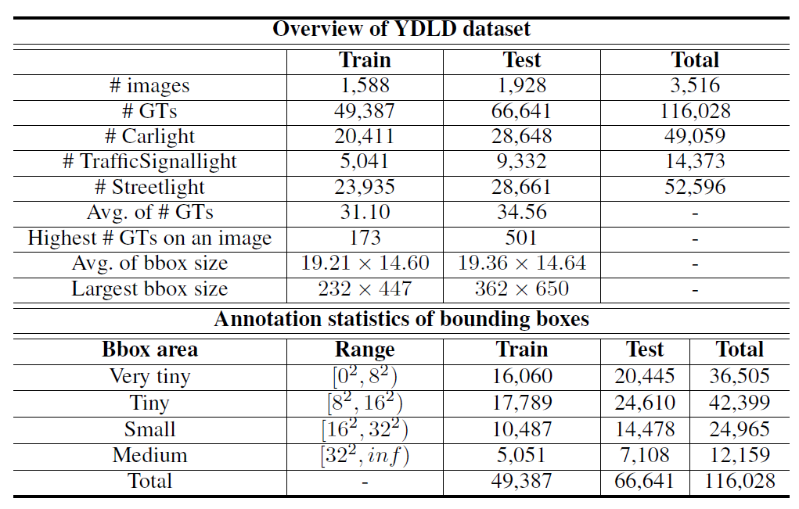

# **2025/8/5**

##  A New Multi-Source Light Detection Benchmark and Semi-Supervised Focal Light Detection

### Limitation
- 기존 데이터셋은 너무 작고, public opened X
 
### YDLD
- 직접 데이터를 제작함 
- data curation, data preprocess단계에서 privacy문제, 빛의 모호함 문제 등은 모두 해결
- very tiny data까지 갖고있음

### Failure Analysis
- 배경에서 false positive가 자주 발생하는 문제점을 발견

### Method
- 위 문제를 해결할 방법
1. lightness attention prior
2. lightness focal loss
3. SS-FLD: Semi-supervised focal light detection

#### lightness attention prior
- bbox결과를 accumulation해서 각 클래스에 대한 confidence map을 만들고 step을 거치기

#### lightness focal loss
- false positive를 효과적으로 줄이기 위해 FP가 발생하면 loss가 증가하게끔 하는 term을 추가함

- 기존 loss보다 더 fp에 민감하게 반응함을 입증

#### SS-FLD
- label data와 unlabeled data를 함께 사용

### Experiment
- 평가는 tiny OD를 측정했고 20개의 detector에 대해 측정해본 결과 젤 좋은건 26%였음
- transfer learning으로 실험

## GOAL: Global-local Object Alignment Learning
### Introduction
- CLIP이 효과적인 이유는 대량의 데이터셋이기 때문임
- CLIP은 77토큰 길이 제한이 있음. 이는 뒷부분에 중요한 내용이 나오는 데이터가 truncated되는 한계점이 있음

### Method

- LISM(Local Image sentence matching)
 : text내에 세밀한 정보들을 image segment로 매칭시키기

- TSL(Token similarity-based learning) 
 : local-global의 contrastive learning을 통해 세밀한 정보들을 학습하게함

### Result
- 1만장 데이터를 기존 CLIP에 10에폭 동안 fine-tuning함
- LONG-CLIP과 비교해보면 1/100 데이터 수준으로 좋은 결과를 보임

## Generative Densification: Learning to Densify Gaussians for High-Fidelity Generalizable 3D Reconstruction
- NERF/3D-GS는 per-scene optimization으로 scene마다 반복적인 최적화를 함. 이는 시간이 너무 오래걸린다는 한계점이 있음

## Learning Audio-guided Video Representation with Gated Attention for Video-Text Retrieval
- 텍스트를 query로 비디어를 representation
- 오디오가 도움이 되긴 하지만, 배경음악처럼 방해요소가 될 수도 있음

### Limitations of previous work
- 오디오를 무작정 사용하는 문제
- 비디오와 텍스트 간 cross-attention을 할 때 computational cost

### Method

**3가지를 고려한다**
1. embedding extraction : 학습된 AST로 tokenization 후 정해진 개수의 토큰으로 전환, clip encoder로 각각을 임베딩
2. audio-video fusion : 비디오가 오디오와 걸맞다 or 아니다를 판단. gated fusion block을 0으로 하냐 아니냐로 on/off방식 

3. video-text alignment : positive는 가깝게, negative는 멀게 학습. 이때 아예 0,1로 하는 게 맞을까?하는 의문 왜냐하면 정답이 아니어도 비슷할수도 있고 맞을수도있음 그래서 텍스트는 텍스트끼리, 비디오는 비디오끼리 cosine similarity를 계산해서 그게 만약 크면 embedding space에서 너무 멀리 떨어뜨리려고는 안하는 그런 방법을 줌. 이거를 이제 adaptive contrasive loss라 하심

### Result
- 기존 모델보다 14배 빠른 latency를 달성했고 성능 향상도 달성했음(큰 폭 x)
- 다양한 벤치마크에서도 좋은 성능을 보임

### Conclusion
- audio signal이 visual information만으로 표현 가능하다는 전제가 있었고 그걸 뒷받침해주는 결과
- 저자의 gating attention은 오디오를 쓸지말지를 반드시 고려한다는 점에서 한계가 있다고 말하심

## KEYNOTE
- Michal Irani

