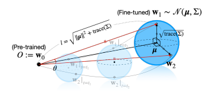

2025.08.04~ 2025.08.06

2025 KCCV https://www.kcvs.kr/?act=info.workshop&pseq=8

당일날 필기하고 정리한 내용은 각 날짜 폴더의 md파일에 있습니다 ex)Aug4/Aug4.md

# KCCV에서 보고 읽고싶어진 논문 list
- Auto-Encoded Supervision for Perceptual Image Super-Resolution, CVPR 2025
  - 마지막날 KEYNOTE에서 Transformer -> VAE 가 될 것이라는 말씀이 있었음. 그래서 Autoencoder에 대해 먼저 공부하고 이 논문을 읽어보고 싶어짐. 또한 이 기회에 diffusion model을 공부해볼 수 있을듯함
- Online Temporal Action Localization with Memory-Augmented Transformer, ECCV 2024
    - 주기적으로 봐야 안까먹는다는 인간의 뇌신경을 모티브로 한 논문. 매우 흥미로움
- Parrot: Pareto-optimal Multi-Reward Reinforcement Learning Framework for Text-to-Image Generation, ECCV 2024
    - RL-PPO 알고리즘을 학습단계에서 적용하여 프로픔트 튜닝을 하는 방법. 강화학습 복슴겸 insight를 넓히기 좋은듯 함

# KCCV에서 가장 흥미로웠던 논문 list
- Model Stock: All We Need Is Just a Few Fine-tuned Models, ECCV 2024
    - 대형 모델을 fine-tuning할 때, 여러개를 만들어서 평균내는데 그러지 말고 두 개의 모델만 사용해서 중심에 가까운 모델을 만드는 것
    - 이 그림이 아주 흥미로움 
- Computational Modeling of Neurodegeneration in the Aging Brain
    - 왜 검색하면 안나오는지 모르겠지만 뇌를 분석하는 AI분야에 대해 처음 접하게 됨. 뇌의 기능적 영역들을 전처리 하고 특정 질환(알츠하이머)에 연관짓는 과정에서 AI모델링을 사용함

# 산업 환경 AI
- 대기업의 경우, 자체 LLM을 개발해서 기밀 유지를 하려고 함
- 3D depth estimation기술을 개발해서 위험한 일 시공작업에서 AI를 먼저 적극 활용한다고 함
- 자동화 기술에 중점을 두는 기업이 많았고, 데이터를 자체적으로 전처리하는 과정이 꽤 골치아파보였음

# 근처맛집
- 수변최고돼지국밥
-     
